## Exercise 0.4: New note

Create a similar diagram depicting the situation where the user creates a new note on page https://studies.cs.helsinki.fi/exampleapp/notes when writing something into the text field and clicking the submit button.

## Exercise 0.5: Single page app

Create a diagram depicting the situation where the user goes to the single page app version of the notes app at https://studies.cs.helsinki.fi/exampleapp/spa.

```mermaid
sequenceDiagram
browser->>server: HTTP GET https://studies.cs.helsinki.fi/exampleapp/spa
server-->>browser: /exampleapp/spa
browser->>server: HTTP GET https://studies.cs.helsinki.fi/exampleapp/main.css
server-->>browser: /exampleapp/main.css
browser->>server: HTTP GET https://studies.cs.helsinki.fi/exampleapp/spa.js
server-->>browser: spa.js
browser->>server: HTTP GET https://studies.cs.helsinki.fi/exampleapp/data.json
server-->>browser: [{ "content": "Luvun 147 neliö on 21609", "date": "2019-01-03T15:11:22.123Z" }, ...]
browser-->>server: HTTP GET https://studies.cs.helsinki.fi/favicon.ico
server-->>browser: favicon.ico
```

## Exercise 0.6: New note

Create a diagram depicting the situation where the user creates a new note using the single page version of the app.

